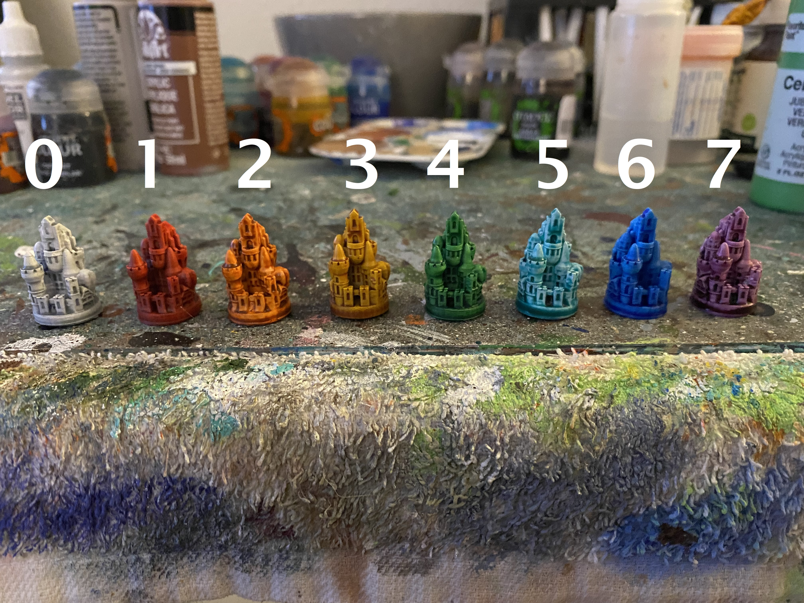
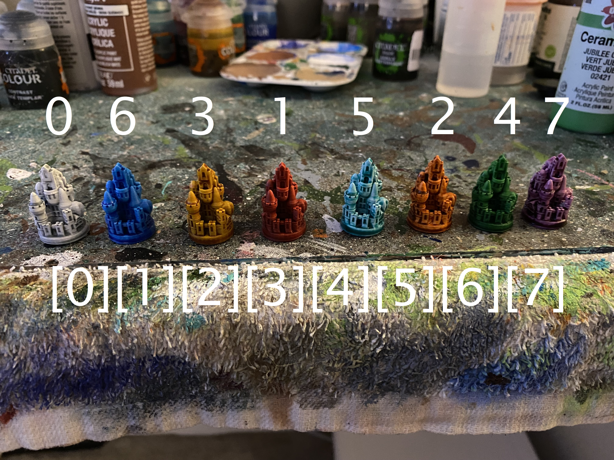
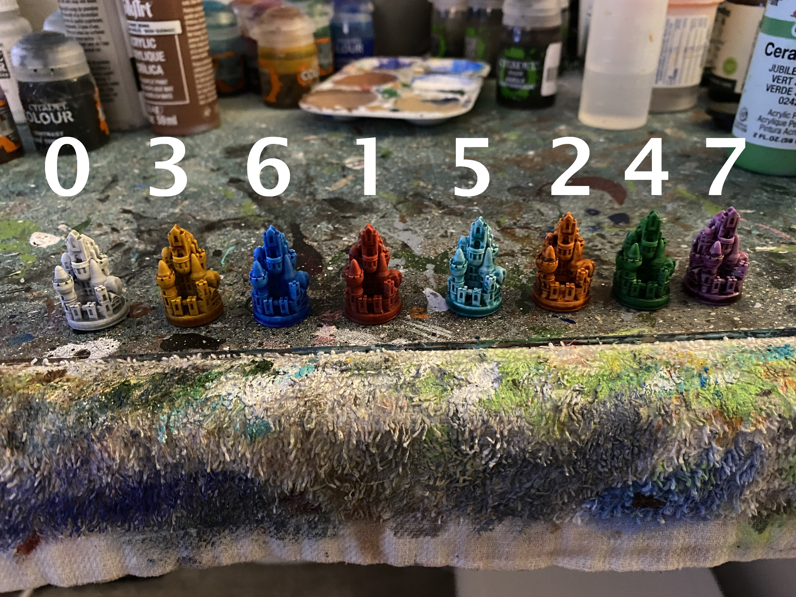
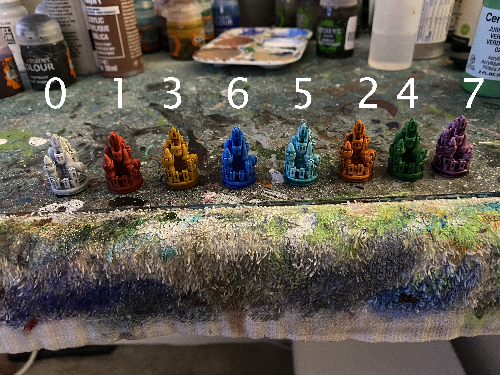

# CODE CHALLENGE 26 | INSERTION SORT

### What Is Insertion Sort?

Insertion sort is a method of sorting an array by dividing the array into a 'sorted' portion and 'unsorted' portion. Then we compare the unsorted item to see if it is larger than the previous element, if not we insert the new item.

### VISUAL AND EXPLINATION

Looking at the text above, what does that mean?

Ultimatley, when we look at Insertion Sorting, we are essentially comparing the left most current value of an array to the currently "queued" value, and validating which one of those goes in which direction.

We also "store" the currently queued value as we move it along the sorted path within the array as a temp value before correctly sorting it.

Lets take a look!

The above image shows 7 different, 3D printed player pieces for the popular board game, Settlers of Catan -- painted in a color and assigned a number value for algorithmic purposes, based on the colors of the rainbow. White (0) | Red(1) | Orange(2) | Yellow(3) | Green(4) | Teal(5) | Blue(6) | Purple(7)

The colors (or array), is arranged out of order for this demonstration to show the functionality of insertion sort method

With the color white sitting at the index of 0 within the array, that color will not be moving as we run through the method's algorithm.

To begin, the function of insertion_Sort will run with the condition of (colors). From there we will enter the for loop looking at the full length of the colors (array of numbers). Tehn, we will declair the varibale of "x" and setting that equal to "i -1".

We will also declair "temp" as "colors[i]", which will allow us to store the currently moving or replaced value in a outside space, before finding where it needs to be sorted.

Based on the current example, lets look at "blue" and "yellow".

Because the white piece is already correctly sorted at both value and index 0, it will stay in place and the algorithm will move on to "blue" with the value of 6. That value is also correctly sorted, currently sitting at the index of 1 within the array. From there, lets move on to "yellow", currently valued at 3 and at the index of 2.

Because yellow with its value of 3 is higher within the array, it will first jump into temp, compare against the value of blue(6), yellow will then shift to the left and push blue to the right. See the visual below as the array now sits:

Again, because blue cannot move due to its currently sorted value, we will move on to red. Red holds the value of 1. It will compare against blue, and move to the left. It will also compare to yellow, with its value of 3 still present but now sitting at index 1. Because red comes first, both visually and due to its value, it shifts once more before bouncing off of white and taking its correct, final sorted placement at index 1.

For the rest of the colors and their values, see the final image below as we run the algorithm through orange, green, teal and purple to correctly sort the array of colors.

### CONCLUSION

Finally, we return and console log the final output of the array via the insertion_Sort function, now correctly sorted -- White (0) | Red(1) | Orange(2) | Yellow(3) | Green(4) | Blue(5) | Teal(6) | Purple(7)